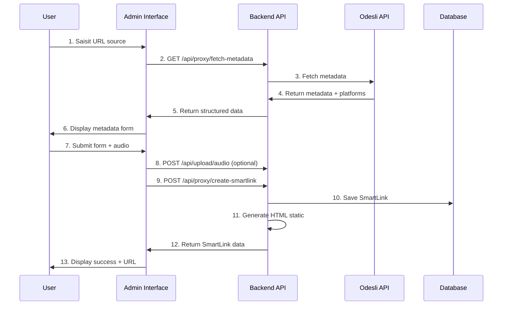

# Documentation Technique - MDMC Admin Interface

## 🏗️ Architecture Générale

### Vue d'ensemble du système

```
┌─────────────────────────────────────────────────────────────────┐
│                    MDMC SmartLinks Platform                     │
├─────────────────────────────────────────────────────────────────┤
│                                                                 │
│  ┌─────────────┐  ┌─────────────┐  ┌─────────────┐            │
│  │  Frontend   │  │    Admin    │  │   Backend   │            │
│  │   React     │  │ Interface   │  │   Express   │            │
│  │ Port 3001   │  │  Port 3003  │  │  Port 3002  │            │
│  │             │  │             │  │             │            │
│  │ • SEO Pages │  │ • Dashboard │  │ • REST API  │            │
│  │ • Marketing │  │ • CRUD SL   │  │ • SmartLinks│            │
│  │ • Landing   │  │ • Analytics │  │ • MongoDB   │            │
│  └─────────────┘  └─────────────┘  └─────────────┘            │
│         │                 │                 │                  │
│         └─────────────────┼─────────────────┘                  │
│                           │                                    │
│                  ┌─────────────┐                               │
│                  │  Database   │                               │
│                  │  MongoDB    │                               │
│                  │             │                               │
│                  │ • SmartLinks│                               │
│                  │ • Artists   │                               │
│                  │ • Analytics │                               │
│                  └─────────────┘                               │
│                                                                 │
├─────────────────────────────────────────────────────────────────┤
│                     External Services                          │
│                                                                 │
│  ┌─────────────┐  ┌─────────────┐  ┌─────────────┐            │
│  │   Odesli    │  │ Cloudinary  │  │   Social    │            │
│  │     API     │  │   Upload    │  │  Networks   │            │
│  │             │  │             │  │             │            │
│  │ • Metadata  │  │ • Audio     │  │ • Facebook  │            │
│  │ • Platforms │  │ • Images    │  │ • Twitter   │            │
│  │ • Links     │  │ • Storage   │  │ • WhatsApp  │            │
│  └─────────────┘  └─────────────┘  └─────────────┘            │
└─────────────────────────────────────────────────────────────────┘
```

## 🔧 Interface Admin - Architecture Détaillée

### 1. Serveur Express (server.js)

```javascript
// Architecture en couches
┌─────────────────────────────────────┐
│           HTTP Middleware           │
├─────────────────────────────────────┤
│ • Helmet (Security Headers)         │
│ • CORS (Cross-Origin)              │
│ • Rate Limiting (100/15min)        │
│ • Body Parser (JSON/URL-encoded)   │
└─────────────────────────────────────┘
               │
┌─────────────────────────────────────┐
│           Route Handlers            │
├─────────────────────────────────────┤
│ GET  /                → dashboard   │
│ GET  /dashboard       → dashboard   │
│ GET  /smartlinks/create → create    │
│ GET  /smartlinks/list → list        │
│ GET  /config.js       → config      │
│ GET  /health          → health      │
└─────────────────────────────────────┘
               │
┌─────────────────────────────────────┐
│         Static File Serving         │
├─────────────────────────────────────┤
│ • /assets/css/admin.css             │
│ • /assets/js/admin.js               │
│ • /pages/*.html                     │
└─────────────────────────────────────┘
```

### 2. Configuration de Sécurité

```javascript
// Content Security Policy
helmet({
  contentSecurityPolicy: {
    directives: {
      defaultSrc: ["'self'"],
      styleSrc: ["'self'", "'unsafe-inline'", "https://fonts.googleapis.com"],
      scriptSrc: ["'self'", "'unsafe-inline'"],
      fontSrc: ["'self'", "https://fonts.gstatic.com"],
      imgSrc: ["'self'", "data:", "https:", "http:"],
      connectSrc: ["'self'", BACKEND_URL]
    }
  }
})

// Rate Limiting
rateLimit({
  windowMs: 15 * 60 * 1000, // 15 minutes
  max: 100, // 100 requêtes max par IP
  message: 'Trop de requêtes depuis cette IP'
})

// CORS
cors({
  origin: [
    'http://localhost:3003',
    'https://admin.mdmcmusicads.com',
    BACKEND_URL
  ],
  credentials: true
})
```

### 3. Frontend Architecture (Client-Side)

```
┌─────────────────────────────────────────────────────────┐
│                   Client Architecture                   │
├─────────────────────────────────────────────────────────┤
│                                                         │
│  ┌─────────────┐  ┌─────────────┐  ┌─────────────┐    │
│  │    HTML     │  │     CSS     │  │ JavaScript  │    │
│  │   Pages     │  │   Styles    │  │    Logic    │    │
│  │             │  │             │  │             │    │
│  │ • Dashboard │  │ • Variables │  │ • MDMCAdmin │    │
│  │ • Create    │  │ • Layout    │  │ • API Calls │    │
│  │ • List      │  │ • Components│  │ • UI Logic  │    │
│  │ • 404       │  │ • Responsive│  │ • Validation│    │
│  └─────────────┘  └─────────────┘  └─────────────┘    │
│         │                 │                 │          │
│         └─────────────────┼─────────────────┘          │
│                           │                            │
│  ┌─────────────────────────────────────────────────┐   │
│  │              Browser APIs                       │   │
│  │                                                 │   │
│  │ • Fetch API (HTTP Requests)                    │   │
│  │ • localStorage (Session Management)            │   │
│  │ • Clipboard API (Copy URLs)                    │   │
│  │ • FormData (File Uploads)                      │   │
│  │ • History API (Navigation)                     │   │
│  └─────────────────────────────────────────────────┘   │
└─────────────────────────────────────────────────────────┘
```

## 🎨 Design System

### Variables CSS

```css
:root {
  /* Couleurs primaires MDMC */
  --primary: #E50914;      /* Rouge MDMC signature */
  --secondary: #141414;    /* Noir élégant */
  --success: #28a745;      /* Vert succès */
  --danger: #dc3545;       /* Rouge erreur */
  --warning: #ffc107;      /* Jaune attention */
  --info: #17a2b8;         /* Bleu information */
  --light: #f8f9fa;        /* Gris très clair */
  --dark: #343a40;         /* Gris foncé */
  --white: #ffffff;        /* Blanc pur */
  
  /* Espacements et formes */
  --border-radius: 8px;    /* Radius standard */
  --shadow: 0 2px 4px rgba(0,0,0,0.1);
  --shadow-hover: 0 4px 8px rgba(0,0,0,0.15);
  --transition: all 0.3s ease;
}
```

### Grille de Layout

```css
/* Système de grille flexible */
.admin-container {
  min-height: 100vh;
  display: flex;
  flex-direction: column;
}

.admin-header {
  position: sticky;
  top: 0;
  z-index: 1000;
  background: var(--white);
  box-shadow: var(--shadow);
}

.admin-main {
  flex: 1;
  padding: 2rem;
  max-width: 1200px;
  margin: 0 auto;
  width: 100%;
}
```

## 🔄 Flux de Données

### 1. Création de SmartLink



### 2. Gestion des États

```javascript
// États de l'application
const AppStates = {
  LOADING: 'loading',
  IDLE: 'idle',
  SUBMITTING: 'submitting',
  SUCCESS: 'success',
  ERROR: 'error'
};

// Machine d'état pour création SmartLink
const CreateStates = {
  STEP_1: 'url_input',      // Saisie URL
  STEP_2: 'metadata_edit',  // Édition métadonnées
  STEP_3: 'result_display'  // Affichage résultat
};
```

## 📡 API Communication

### Configuration

```javascript
class MDMCAdmin {
  constructor() {
    this.config = window.MDMC_CONFIG || {
      API_BASE_URL: 'http://localhost:3002',
      ENVIRONMENT: 'development'
    };
  }

  async apiCall(endpoint, options = {}) {
    const url = `${this.config.API_BASE_URL}${endpoint}`;
    const defaultOptions = {
      headers: {
        'Content-Type': 'application/json',
      }
    };

    // Authentification
    const token = localStorage.getItem('adminToken');
    if (token) {
      defaultOptions.headers['Authorization'] = `Bearer ${token}`;
    }

    const response = await fetch(url, { ...defaultOptions, ...options });
    return await response.json();
  }
}
```

### Endpoints Utilisés

```javascript
// Endpoints API Backend
const API_ENDPOINTS = {
  // SmartLinks
  FETCH_METADATA: '/api/proxy/fetch-metadata',
  CREATE_SMARTLINK: '/api/proxy/create-smartlink',
  LIST_SMARTLINKS: '/api/smartlinks',
  DELETE_SMARTLINK: '/api/v1/smartlinks/:id',
  
  // Upload
  UPLOAD_AUDIO: '/api/upload/audio',
  
  // Stats
  DASHBOARD_STATS: '/api/stats/dashboard',
  
  // Health
  HEALTH_CHECK: '/api/health'
};
```

## 🔒 Sécurité

### Authentification

```javascript
// Token Management
class AuthManager {
  static setToken(token) {
    localStorage.setItem('adminToken', token);
  }
  
  static getToken() {
    return localStorage.getItem('adminToken') || 'dev-token-bypass';
  }
  
  static clearToken() {
    localStorage.removeItem('adminToken');
  }
  
  static isAuthenticated() {
    return !!this.getToken();
  }
}
```

### Validation Côté Client

```javascript
// Validation des formulaires
validateForm(form) {
  let isValid = true;
  const requiredFields = form.querySelectorAll('[required]');

  requiredFields.forEach(field => {
    field.classList.remove('is-invalid', 'is-valid');
    
    if (!field.value.trim()) {
      field.classList.add('is-invalid');
      isValid = false;
    } else {
      field.classList.add('is-valid');
    }
  });

  // Validation spécifique URL
  form.querySelectorAll('input[type="url"]').forEach(url => {
    if (url.value && !this.isValidUrl(url.value)) {
      url.classList.add('is-invalid');
      isValid = false;
    }
  });

  return isValid;
}
```

## 📊 Performance

### Optimisations Implémentées

1. **Debouncing** pour les recherches
```javascript
searchFilter.addEventListener('input', 
  mdmcAdmin.debounce(applyFilters, 300)
);
```

2. **Lazy Loading** pour les images
```html

```

3. **Pagination** pour les listes
```javascript
const pageItems = filteredSmartLinks.slice(
  (currentPage - 1) * itemsPerPage, 
  currentPage * itemsPerPage
);
```

4. **Cache localStorage** pour auto-save
```javascript
autoSave(form) {
  const formData = new FormData(form);
  const data = Object.fromEntries(formData.entries());
  const saveKey = `autosave_${form.id}_${Date.now()}`;
  localStorage.setItem(saveKey, JSON.stringify(data));
}
```

## 🧪 Testing Strategy

### Types de Tests Recommandés

1. **Tests Unitaires** (À implémenter)
```javascript
// Exemple avec Jest
describe('MDMCAdmin', () => {
  test('should validate email correctly', () => {
    const admin = new MDMCAdmin();
    expect(admin.isValidEmail('test@mdmc.com')).toBe(true);
    expect(admin.isValidEmail('invalid')).toBe(false);
  });
});
```

2. **Tests d'Intégration** (À implémenter)
```javascript
// Test API calls
describe('API Integration', () => {
  test('should fetch SmartLinks', async () => {
    const response = await mdmcAdmin.apiCall('/api/smartlinks');
    expect(response.success).toBe(true);
    expect(Array.isArray(response.data)).toBe(true);
  });
});
```

3. **Tests E2E** (À implémenter avec Playwright)
```javascript
// Test complet création SmartLink
test('Create SmartLink workflow', async ({ page }) => {
  await page.goto('http://localhost:3003/smartlinks/create');
  await page.fill('#sourceUrl', 'https://open.spotify.com/track/test');
  await page.click('[type="submit"]');
  // ... rest of workflow
});
```

## 📈 Monitoring et Logs

### Logs Structure

```javascript
// Format des logs
const LogLevels = {
  ERROR: 'error',
  WARN: 'warn', 
  INFO: 'info',
  DEBUG: 'debug'
};

// Exemple de log
console.log({
  timestamp: new Date().toISOString(),
  level: 'INFO',
  service: 'mdmc-admin',
  action: 'smartlink_created',
  data: { smartlinkId: 'abc123', userId: 'admin' }
});
```

### Métriques à Surveiller

1. **Performance**
   - Temps de réponse API
   - Temps de chargement pages
   - Taille des bundles

2. **Usage**
   - SmartLinks créés/jour
   - Erreurs utilisateur
   - Sessions admin

3. **Erreurs**
   - Échecs API
   - Erreurs JavaScript
   - Timeouts réseau

Cette documentation technique fournit une base solide pour le développement, la maintenance et l'évolution de l'interface admin MDMC.