# Logiques et Flux - MDMC Admin Interface

## 🎯 Vue d'ensemble des Logiques

### Architecture Logique

```
┌─────────────────────────────────────────────────────────────────┐
│                    LOGIQUES MÉTIER MDMC                        │
├─────────────────────────────────────────────────────────────────┤
│                                                                 │
│  ┌─────────────┐  ┌─────────────┐  ┌─────────────┐            │
│  │   Création  │  │   Gestion   │  │  Analytics  │            │
│  │ SmartLinks  │  │    CRUD     │  │ & Monitoring│            │
│  │             │  │             │  │             │            │
│  │ • Workflow  │  │ • Listing   │  │ • Stats     │            │
│  │ • Validation│  │ • Filtres   │  │ • Metrics   │            │
│  │ • États     │  │ • Actions   │  │ • Reports   │            │
│  └─────────────┘  └─────────────┘  └─────────────┘            │
│                                                                 │
├─────────────────────────────────────────────────────────────────┤
│                    LOGIQUES TECHNIQUES                         │
│                                                                 │
│  ┌─────────────┐  ┌─────────────┐  ┌─────────────┐            │
│  │    Auth &   │  │  UI State   │  │  Data Flow  │            │
│  │  Security   │  │ Management  │  │ Management  │            │
│  │             │  │             │  │             │            │
│  │ • Sessions  │  │ • Forms     │  │ • API Calls │            │
│  │ • Tokens    │  │ • Modals    │  │ • Caching   │            │
│  │ • Validation│  │ • Navigation│  │ • Sync      │            │
│  └─────────────┘  └─────────────┘  └─────────────┘            │
└─────────────────────────────────────────────────────────────────┘
```

## 🔄 Flux de Création SmartLink

### Machine d'État Complète

```javascript
// États possibles du workflow
const CreateSmartLinkStates = {
  // Étape 1: URL Input
  IDLE: 'idle',
  FETCHING_METADATA: 'fetching_metadata',
  METADATA_SUCCESS: 'metadata_success', 
  METADATA_ERROR: 'metadata_error',
  
  // Étape 2: Form Edition
  EDITING_METADATA: 'editing_metadata',
  UPLOADING_AUDIO: 'uploading_audio',
  AUDIO_UPLOADED: 'audio_uploaded',
  AUDIO_ERROR: 'audio_error',
  
  // Étape 3: Creation
  CREATING_SMARTLINK: 'creating_smartlink',
  CREATION_SUCCESS: 'creation_success',
  CREATION_ERROR: 'creation_error',
  
  // États finaux
  COMPLETED: 'completed',
  CANCELLED: 'cancelled'
};

// Transitions autorisées
const stateTransitions = {
  [CreateSmartLinkStates.IDLE]: [
    CreateSmartLinkStates.FETCHING_METADATA
  ],
  [CreateSmartLinkStates.FETCHING_METADATA]: [
    CreateSmartLinkStates.METADATA_SUCCESS,
    CreateSmartLinkStates.METADATA_ERROR
  ],
  [CreateSmartLinkStates.METADATA_SUCCESS]: [
    CreateSmartLinkStates.EDITING_METADATA
  ],
  [CreateSmartLinkStates.EDITING_METADATA]: [
    CreateSmartLinkStates.UPLOADING_AUDIO,
    CreateSmartLinkStates.CREATING_SMARTLINK
  ],
  [CreateSmartLinkStates.UPLOADING_AUDIO]: [
    CreateSmartLinkStates.AUDIO_UPLOADED,
    CreateSmartLinkStates.AUDIO_ERROR
  ],
  [CreateSmartLinkStates.AUDIO_UPLOADED]: [
    CreateSmartLinkStates.CREATING_SMARTLINK
  ],
  [CreateSmartLinkStates.CREATING_SMARTLINK]: [
    CreateSmartLinkStates.CREATION_SUCCESS,
    CreateSmartLinkStates.CREATION_ERROR
  ],
  [CreateSmartLinkStates.CREATION_SUCCESS]: [
    CreateSmartLinkStates.COMPLETED
  ]
};
```

### Workflow Détaillé

```mermaid
graph TD
    A[Début: Page Create] --> B[Étape 1: Saisie URL]
    B --> C{URL Valide?}
    C -->|Non| D[Erreur Validation]
    D --> B
    C -->|Oui| E[Fetch Metadata Odesli]
    E --> F{Metadata OK?}
    F -->|Non| G[Erreur Odesli]
    G --> B
    F -->|Oui| H[Étape 2: Édition Form]
    H --> I[Affichage Metadata]
    I --> J{Upload Audio?}
    J -->|Oui| K[Upload Cloudinary]
    K --> L{Upload OK?}
    L -->|Non| M[Erreur Upload]
    M --> J
    L -->|Oui| N[Audio URL Stockée]
    J -->|Non| N
    N --> O[Validation Form]
    O --> P{Form Valide?}
    P -->|Non| Q[Erreurs Affichées]
    Q --> H
    P -->|Oui| R[Création SmartLink]
    R --> S{Création OK?}
    S -->|Non| T[Erreur Backend]
    T --> H
    S -->|Oui| U[Étape 3: Succès]
    U --> V[Affichage URL]
    V --> W[Actions: Copier/Partager]
    W --> X[Fin Workflow]
```



### Implementation JavaScript

```javascript
class CreateSmartLinkWorkflow {
  constructor() {
    this.currentState = CreateSmartLinkStates.IDLE;
    this.currentStep = 1;
    this.metadata = null;
    this.audioUrl = null;
    this.smartlinkData = null;
    
    this.initializeEventListeners();
  }

  // Gestion des transitions d'état
  setState(newState, data = null) {
    const allowedTransitions = stateTransitions[this.currentState] || [];
    
    if (!allowedTransitions.includes(newState)) {
      console.warn(`Transition non autorisée: ${this.currentState} → ${newState}`);
      return false;
    }
    
    console.log(`État: ${this.currentState} → ${newState}`);
    this.currentState = newState;
    this.updateUI(newState, data);
    return true;
  }

  // Mise à jour de l'interface selon l'état
  updateUI(state, data) {
    switch (state) {
      case CreateSmartLinkStates.FETCHING_METADATA:
        this.showLoading('fetchMetadataBtn', 'Récupération...');
        break;
        
      case CreateSmartLinkStates.METADATA_SUCCESS:
        this.hideLoading('fetchMetadataBtn');
        this.populateMetadataForm(data);
        this.goToStep(2);
        break;
        
      case CreateSmartLinkStates.METADATA_ERROR:
        this.hideLoading('fetchMetadataBtn');
        this.showError('Impossible de récupérer les métadonnées');
        break;
        
      case CreateSmartLinkStates.UPLOADING_AUDIO:
        this.showUploadProgress();
        break;
        
      case CreateSmartLinkStates.AUDIO_UPLOADED:
        this.showUploadSuccess(data.url);
        this.audioUrl = data.url;
        break;
        
      case CreateSmartLinkStates.CREATING_SMARTLINK:
        this.showLoading('createSmartLinkBtn', 'Création...');
        break;
        
      case CreateSmartLinkStates.CREATION_SUCCESS:
        this.hideLoading('createSmartLinkBtn');
        this.displayResult(data);
        this.goToStep(3);
        break;
        
      case CreateSmartLinkStates.CREATION_ERROR:
        this.hideLoading('createSmartLinkBtn');
        this.showError('Erreur lors de la création');
        break;
    }
  }

  // Étape 1: Fetch Metadata
  async handleFetchMetadata(sourceUrl) {
    if (!this.setState(CreateSmartLinkStates.FETCHING_METADATA)) return;
    
    try {
      const response = await mdmcAdmin.apiCall(
        `/api/proxy/fetch-metadata?url=${encodeURIComponent(sourceUrl)}`
      );
      
      if (response.success) {
        this.metadata = response.data;
        this.setState(CreateSmartLinkStates.METADATA_SUCCESS, response.data);
      } else {
        this.setState(CreateSmartLinkStates.METADATA_ERROR);
      }
    } catch (error) {
      console.error('Erreur fetch metadata:', error);
      this.setState(CreateSmartLinkStates.METADATA_ERROR);
    }
  }

  // Étape 2: Upload Audio (optionnel)
  async handleAudioUpload(file) {
    if (!this.setState(CreateSmartLinkStates.UPLOADING_AUDIO)) return;
    
    try {
      const response = await mdmcAdmin.uploadFile(file, '/api/upload/audio');
      
      if (response.success) {
        this.setState(CreateSmartLinkStates.AUDIO_UPLOADED, response.data);
      } else {
        this.setState(CreateSmartLinkStates.AUDIO_ERROR);
      }
    } catch (error) {
      console.error('Erreur upload audio:', error);
      this.setState(CreateSmartLinkStates.AUDIO_ERROR);
    }
  }

  // Étape 3: Création SmartLink
  async handleCreateSmartLink(formData) {
    if (!this.setState(CreateSmartLinkStates.CREATING_SMARTLINK)) return;
    
    try {
      const smartlinkData = {
        trackTitle: formData.get('trackTitle'),
        artistName: formData.get('artistName'),
        description: formData.get('description'),
        coverImageUrl: this.metadata?.thumbnailUrl,
        previewAudioUrl: this.audioUrl,
        platformLinks: this.formatPlatformLinks(this.metadata?.links),
        isPublished: true
      };

      const response = await mdmcAdmin.apiCall('/api/proxy/create-smartlink', {
        method: 'POST',
        body: JSON.stringify(smartlinkData)
      });

      if (response.success) {
        this.smartlinkData = response.data;
        this.setState(CreateSmartLinkStates.CREATION_SUCCESS, response.data);
      } else {
        this.setState(CreateSmartLinkStates.CREATION_ERROR);
      }
    } catch (error) {
      console.error('Erreur création SmartLink:', error);
      this.setState(CreateSmartLinkStates.CREATION_ERROR);
    }
  }
}
```

## 🗂️ Logique de Gestion CRUD

### Liste des SmartLinks

```javascript
class SmartLinksManager {
  constructor() {
    this.allSmartLinks = [];
    this.filteredSmartLinks = [];
    this.currentPage = 1;
    this.itemsPerPage = 10;
    this.filters = {
      search: '',
      status: '',
      sortBy: 'createdAt',
      sortOrder: 'desc'
    };
    
    this.initializeFilters();
  }

  // Chargement initial des données
  async loadSmartLinks() {
    try {
      const response = await mdmcAdmin.apiCall('/api/smartlinks');
      
      if (response.success) {
        this.allSmartLinks = response.data.sort((a, b) => 
          new Date(b.createdAt) - new Date(a.createdAt)
        );
        this.applyFilters();
        this.render();
      }
    } catch (error) {
      console.error('Erreur chargement SmartLinks:', error);
      this.showError('Impossible de charger les SmartLinks');
    }
  }

  // Application des filtres
  applyFilters() {
    this.filteredSmartLinks = this.allSmartLinks.filter(sl => {
      // Filtre de recherche
      const matchesSearch = !this.filters.search || 
        sl.trackTitle.toLowerCase().includes(this.filters.search.toLowerCase()) ||
        sl.artistId.name.toLowerCase().includes(this.filters.search.toLowerCase()) ||
        sl.slug.toLowerCase().includes(this.filters.search.toLowerCase());

      // Filtre de statut
      const matchesStatus = !this.filters.status || 
        (this.filters.status === 'published' && sl.isPublished) ||
        (this.filters.status === 'draft' && !sl.isPublished);

      return matchesSearch && matchesStatus;
    });

    // Application du tri
    this.applySorting();
    
    // Reset pagination
    this.currentPage = 1;
  }

  // Logique de tri
  applySorting() {
    this.filteredSmartLinks.sort((a, b) => {
      let valueA, valueB;
      
      switch (this.filters.sortBy) {
        case 'trackTitle':
          valueA = a.trackTitle.toLowerCase();
          valueB = b.trackTitle.toLowerCase();
          break;
        case 'artistName':
          valueA = a.artistId.name.toLowerCase();
          valueB = b.artistId.name.toLowerCase();
          break;
        case 'viewCount':
          valueA = a.viewCount || 0;
          valueB = b.viewCount || 0;
          break;
        case 'createdAt':
        default:
          valueA = new Date(a.createdAt);
          valueB = new Date(b.createdAt);
      }
      
      if (this.filters.sortOrder === 'asc') {
        return valueA > valueB ? 1 : -1;
      } else {
        return valueA < valueB ? 1 : -1;
      }
    });
  }

  // Logique de pagination
  getPaginatedItems() {
    const startIndex = (this.currentPage - 1) * this.itemsPerPage;
    const endIndex = startIndex + this.itemsPerPage;
    return this.filteredSmartLinks.slice(startIndex, endIndex);
  }

  // Suppression avec confirmation
  async deleteSmartLink(id, confirmationName) {
    // Logique de confirmation modale
    if (!await this.confirmDelete(confirmationName)) {
      return false;
    }

    try {
      const response = await mdmcAdmin.apiCall(`/api/v1/smartlinks/${id}`, {
        method: 'DELETE'
      });

      if (response.success) {
        // Mise à jour locale des données
        this.allSmartLinks = this.allSmartLinks.filter(sl => sl._id !== id);
        this.applyFilters();
        this.render();
        
        mdmcAdmin.showNotification('SmartLink supprimé avec succès', 'success');
        return true;
      }
    } catch (error) {
      console.error('Erreur suppression:', error);
      mdmcAdmin.showNotification('Impossible de supprimer le SmartLink', 'danger');
      return false;
    }
  }
}
```

## 📊 Logique Analytics & Dashboard

### Calcul des Statistiques

```javascript
class DashboardAnalytics {
  constructor() {
    this.stats = {
      total_smartlinks: 0,
      total_clicks: 0,
      total_artists: 0,
      active_campaigns: 0,
      conversion_rate: 0,
      top_platforms: [],
      recent_activity: []
    };
  }

  // Calcul des statistiques globales
  calculateStats(smartlinks) {
    this.stats.total_smartlinks = smartlinks.length;
    
    this.stats.total_clicks = smartlinks.reduce((sum, sl) => 
      sum + (sl.viewCount || 0), 0
    );
    
    this.stats.total_artists = new Set(
      smartlinks.map(sl => sl.artistId._id)
    ).size;
    
    this.stats.active_campaigns = smartlinks.filter(sl => 
      sl.isPublished
    ).length;
    
    this.stats.conversion_rate = this.calculateConversionRate(smartlinks);
    this.stats.top_platforms = this.calculateTopPlatforms(smartlinks);
    this.stats.recent_activity = this.getRecentActivity(smartlinks);
  }

  // Calcul du taux de conversion
  calculateConversionRate(smartlinks) {
    const totalViews = smartlinks.reduce((sum, sl) => sum + (sl.viewCount || 0), 0);
    const totalClicks = smartlinks.reduce((sum, sl) => sum + (sl.platformClickCount || 0), 0);
    
    return totalViews > 0 ? ((totalClicks / totalViews) * 100).toFixed(1) : 0;
  }

  // Plateformes les plus populaires
  calculateTopPlatforms(smartlinks) {
    const platformStats = {};
    
    smartlinks.forEach(sl => {
      sl.platformLinks.forEach(link => {
        const platform = link.platform;
        platformStats[platform] = (platformStats[platform] || 0) + 1;
      });
    });
    
    return Object.entries(platformStats)
      .sort(([,a], [,b]) => b - a)
      .slice(0, 5)
      .map(([platform, count]) => ({ platform, count }));
  }

  // Activité récente
  getRecentActivity(smartlinks) {
    return smartlinks
      .sort((a, b) => new Date(b.createdAt) - new Date(a.createdAt))
      .slice(0, 10)
      .map(sl => ({
        id: sl._id,
        action: 'created',
        title: sl.trackTitle,
        artist: sl.artistId.name,
        timestamp: sl.createdAt,
        status: sl.isPublished ? 'published' : 'draft'
      }));
  }

  // Mise à jour temps réel
  async refreshStats() {
    try {
      const response = await mdmcAdmin.apiCall('/api/smartlinks');
      if (response.success) {
        this.calculateStats(response.data);
        this.updateStatsDisplay();
      }
    } catch (error) {
      console.error('Erreur actualisation stats:', error);
    }
  }

  // Mise à jour de l'affichage
  updateStatsDisplay() {
    Object.entries(this.stats).forEach(([key, value]) => {
      const element = document.querySelector(`[data-stat="${key}"]`);
      if (element) {
        if (typeof value === 'number') {
          element.textContent = mdmcAdmin.formatNumber(value);
        } else {
          element.textContent = value;
        }
      }
    });
  }
}
```

## 🎨 Logique UI State Management

### Gestion des Modales

```javascript
class ModalManager {
  constructor() {
    this.activeModals = new Set();
    this.modalStack = [];
  }

  // Ouverture de modale
  openModal(modalId, data = null) {
    const modal = document.getElementById(modalId);
    if (!modal) return false;

    // Fermer les autres modales si nécessaire
    if (this.modalStack.length > 0) {
      const topModal = this.modalStack[this.modalStack.length - 1];
      if (topModal.exclusive) {
        this.closeModal(topModal.id);
      }
    }

    // Configuration des données
    if (data) {
      this.populateModalData(modal, data);
    }

    // Affichage
    modal.classList.remove('d-none');
    document.body.style.overflow = 'hidden';
    
    // Stack management
    this.modalStack.push({ id: modalId, exclusive: true });
    this.activeModals.add(modalId);

    // Focus management
    const firstInput = modal.querySelector('input, button, textarea, select');
    if (firstInput) firstInput.focus();

    return true;
  }

  // Fermeture de modale
  closeModal(modalId) {
    const modal = document.getElementById(modalId);
    if (!modal) return false;

    modal.classList.add('d-none');
    this.activeModals.delete(modalId);
    
    // Stack management
    this.modalStack = this.modalStack.filter(m => m.id !== modalId);
    
    // Restaurer overflow si plus de modales
    if (this.modalStack.length === 0) {
      document.body.style.overflow = '';
    }

    return true;
  }

  // Population des données
  populateModalData(modal, data) {
    Object.entries(data).forEach(([key, value]) => {
      const element = modal.querySelector(`[data-field="${key}"]`);
      if (element) {
        if (element.tagName === 'INPUT' || element.tagName === 'TEXTAREA') {
          element.value = value;
        } else {
          element.textContent = value;
        }
      }
    });
  }
}
```

### State Persistence

```javascript
class StatePersistence {
  constructor() {
    this.storageKey = 'mdmc_admin_state';
    this.state = this.loadState();
  }

  // Sauvegarde de l'état
  saveState(key, value) {
    this.state[key] = value;
    localStorage.setItem(this.storageKey, JSON.stringify(this.state));
  }

  // Chargement de l'état
  loadState() {
    try {
      const saved = localStorage.getItem(this.storageKey);
      return saved ? JSON.parse(saved) : {};
    } catch (error) {
      console.warn('Erreur chargement état:', error);
      return {};
    }
  }

  // Récupération d'une valeur
  getState(key, defaultValue = null) {
    return this.state[key] ?? defaultValue;
  }

  // Auto-save pour formulaires
  setupAutoSave(form) {
    const formId = form.id || 'form_' + Date.now();
    
    form.addEventListener('input', mdmcAdmin.debounce(() => {
      const formData = new FormData(form);
      const data = Object.fromEntries(formData.entries());
      this.saveState(`form_${formId}`, data);
    }, 1000));

    // Restauration au chargement
    const savedData = this.getState(`form_${formId}`);
    if (savedData) {
      Object.entries(savedData).forEach(([name, value]) => {
        const field = form.querySelector(`[name="${name}"]`);
        if (field) field.value = value;
      });
    }
  }
}
```

## 🔄 Logiques de Synchronisation

### Real-time Updates

```javascript
class RealtimeSync {
  constructor() {
    this.syncInterval = 30000; // 30 secondes
    this.lastSync = null;
    this.subscribers = new Map();
  }

  // Abonnement aux mises à jour
  subscribe(key, callback) {
    if (!this.subscribers.has(key)) {
      this.subscribers.set(key, []);
    }
    this.subscribers.get(key).push(callback);
  }

  // Notification des abonnés
  notify(key, data) {
    const callbacks = this.subscribers.get(key) || [];
    callbacks.forEach(callback => {
      try {
        callback(data);
      } catch (error) {
        console.error('Erreur callback sync:', error);
      }
    });
  }

  // Synchronisation automatique
  startAutoSync() {
    setInterval(async () => {
      try {
        const response = await mdmcAdmin.apiCall('/api/smartlinks');
        if (response.success) {
          this.notify('smartlinks_updated', response.data);
          this.lastSync = new Date();
        }
      } catch (error) {
        console.error('Erreur sync auto:', error);
      }
    }, this.syncInterval);
  }
}
```

Cette documentation détaille toutes les logiques métier et techniques de l'interface admin MDMC, permettant une compréhension complète du fonctionnement interne.